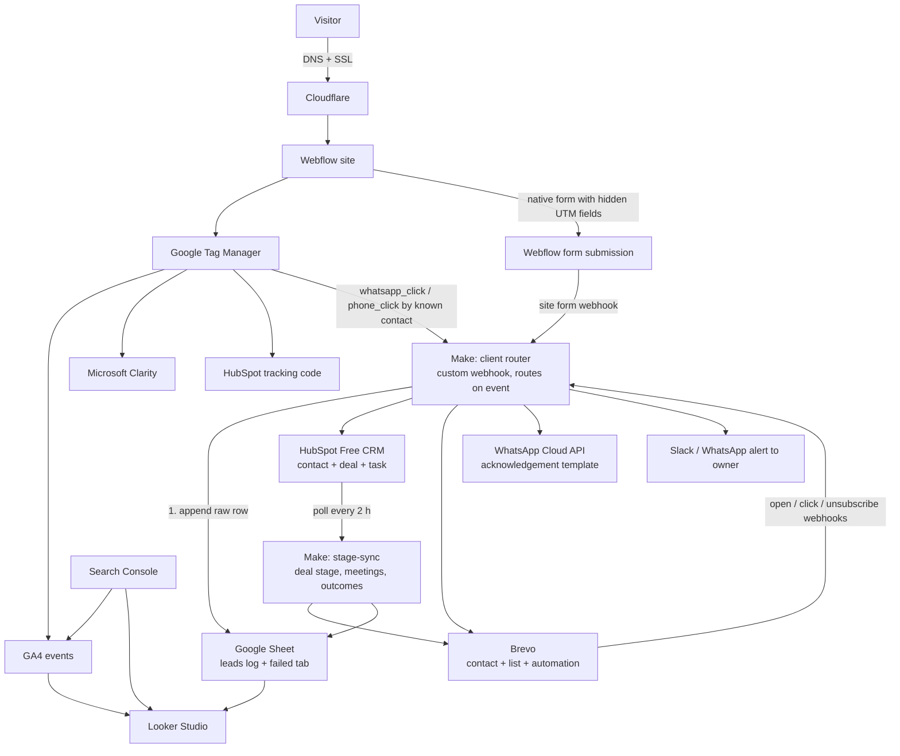

# 02 — Cloud Architecture (Phase 0)

Every client gets the same wiring. The stack is a set of rented tools joined at exactly one seam:
the form submission. Everything downstream of that seam is driven by Make, which is the only piece
the agency owns, and which Phase 1 replaces with the Lead Hub API.

## Data flow

## Walkthrough, one lead end to end

1. **Visitor lands** on `client.com/services?utm_source=google&utm_medium=cpc&utm_campaign=202609-quote-plumbing`. Cloudflare resolves DNS, Webflow serves the page.
2. **GTM loads** on every page; CookieYes runs first inside it and GA4, Clarity and the HubSpot tag fire only after consent. The UTM persistence snippet (appendix B) stores first-touch UTMs in `localStorage` if none exist, and always overwrites last-touch UTMs in `sessionStorage`. GA4 records `page_view`, Clarity starts a recording, the HubSpot tracking cookie is set.
3. **Visitor opens the quote form.** GTM fires `form_start`. On page load the snippet already filled the hidden fields: `utm_*_first`, `utm_*_last`, `gclid`, `fbclid`, `landing_page`, `referrer`, `ga_client_id`, `page_url`.
4. **Visitor submits.** Webflow's built-in reCAPTCHA and the honeypot field filter bots. Webflow stores the submission and redirects to `/thank-you`. GTM fires `generate_lead` on the thank-you page view, which is the GA4 key event. Firing on the page view rather than the submit click means only real submissions count.
5. **Webflow's form webhook posts the full payload** to the client's Make router (a custom webhook, the same URL Brevo and GTM use). The router first appends the raw row to the Sheet `leads` tab so the lead can never be lost, then runs the branches below, each with its own error handler.
6. **HubSpot branch**: search contact by email (phone as fallback), create or update, write the attribution properties within the 10-property budget, create a deal in stage New with the form type as deal name prefix, create a task due in 24 h assigned to the client owner.
7. **Brevo branch**: create or update the contact, set attributes (all UTMs, form type, consent flags), add to list `<client>-new-leads`. Brevo's automation "W1 acknowledgement + W3 nurture" starts from the list-add event.
8. **WhatsApp branch** (only if `consent_whatsapp = true` and the client has an approved template): send the acknowledgement template through the Cloud API module.
9. **Sheet update**: the row appended in step 5 is updated with the HubSpot contact and deal ids and the Brevo contact id. This row is the audit trail and the Looker Studio source.
10. **Alert branch**: Slack message or WhatsApp to the owner: name, phone, form type, source, link to the HubSpot contact.
11. **Later signals**: Brevo posts open, click and unsubscribe webhooks to the router (W4 scoring, Sheet updates). The `stage-sync` scenario polls HubSpot every 2 hours in business hours for deal stages, meetings and outcomes and writes them to Brevo attributes and the Sheet, so W3 exits when the deal is qualified. GTM posts `whatsapp_click` and `phone_click` to the router when the visitor is a known contact.
12. **Reporting**: Looker Studio reads GA4 (sessions, campaigns, `generate_lead`), Search Console (organic) and the leads Sheet (lead-level source, stage). Monthly review uses the three side by side.

Target latency from submit to CRM contact, acknowledgement email and owner alert: under 2 minutes. Under 5 minutes is the SLA.

## Design decisions

### Identity

Email is the primary key across HubSpot, Brevo and the Sheet. Phone (E.164, `+91...`) is the secondary key and the primary key for WhatsApp-first clients whose forms do not require email. GA4 `client_id` is written into a hidden form field so that a web session can be joined to a CRM contact later; this is the only link between web analytics and the lead record in Phase 0, and it is stored in the Sheet and in Brevo, not in HubSpot (property budget).

### The seam

Forms post natively to Webflow, and Make picks them up. We deliberately do **not** use HubSpot embedded forms, even though they give better native attribution, because:

- HubSpot forms carry HubSpot branding on the free tier and are harder to style.
- The Webflow form plus Make is vendor-neutral. In Phase 1 the only change is pointing Make, or the form itself, at the Lead Hub API. No page redesign, no CRM migration, no analytics change.

### Per-client isolation

One of each per client: Webflow site, GTM container, GA4 property, Search Console property, HubSpot portal, Brevo account, Meta Business Manager, Looker Studio report, Slack channel, Make folder. Naming follows `<client-slug>-<tool>-<purpose>` (appendix A).

Trade-off documented for very small clients: one agency Brevo account with a list per client is cheaper to operate, but it mixes sender reputations and makes offboarding messy. Default is one account per client.

### Attribution

- First-touch and last-touch `utm_source`, `utm_medium`, `utm_campaign` are stored on the HubSpot contact.
- Full UTM detail including `utm_content`, `utm_term`, `gclid`, `fbclid`, landing page and referrer is stored in Brevo attributes and in the Sheet.
- GA4 is the source of truth at campaign level (sessions, `generate_lead` per campaign). HubSpot and the Sheet are the source of truth at lead level (which person came from which campaign and what happened to them).
- These two views **will not reconcile 1:1**. GA4 loses consent-declined and ad-blocked visitors; HubSpot loses nothing on the form but has no session data. The monthly report shows both and explains the gap once, in the report template.

### Failure handling

- Every Make branch has an error handler: retry three times with backoff, then write the payload to the `failed` tab of the leads Sheet and post to the agency Slack `#make-failures` channel.
- The Sheet append runs **first** after the trigger so the raw lead is never lost even if HubSpot and Brevo are both down; the ids are filled in afterwards.
- A weekly Make scenario re-plays rows from the `failed` tab.
- Webflow keeps every submission in its own form log as the last-resort backup.

### Behavioural signals on free tiers

HubSpot Free records page views on the contact timeline, but they cannot trigger Make. The only behavioural signals that reach scoring in Phase 0 are:

- form type (from the submission),
- Brevo email opens and clicks (webhooks),
- `whatsapp_click` and `phone_click` sent by GTM straight to a Make webhook, with the stored email or phone of a known contact.

Page-view scoring, session-based intent and cross-device stitching wait for Phase 1.

### What has no home in Phase 0

These feed [05-limitations.md](05-limitations.md) and the build order in [06-transition-plan.md](06-transition-plan.md):

- a cross-client dashboard for the agency,
- lead scoring beyond simple counters,
- server-side tracking,
- a unified event store joining web sessions to leads to deals,
- template versioning across client sites and containers.

## Phase 0 validation gate

Phase 0 is validated, and Phase 1 planning may start, only when all of these hold across at least 3 pilot clients for at least 60 days:

| Metric | Target | Data source |
|---|---|---|
| Time to onboard a client (playbook steps 0-8, agency hours) | ≤ 4 working days | Agency clients sheet, hours logged at step 8 |
| Form submit to CRM contact + acknowledgement email | ≤ 5 min for ≥ 99% of leads | Make run history + Sheet timestamps |
| Leads with complete first-touch UTM attribution | ≥ 80% | Leads Sheet |
| Tool cost per client | ≤ $50/mo | Agency billing sheet |
| Organic clicks, month 3 vs month 1 | +50% | Search Console |
| Client still paying after month 3 | ≥ 2 of 3 | Agency invoices |
| Agency hours per client per month after go-live | ≤ 4 h | Time tracking |

If a metric fails, fix the process and re-run the 60 days. Phase 1 addresses the tool limits in doc 05, not process failures, so it does not start until the gate passes.
